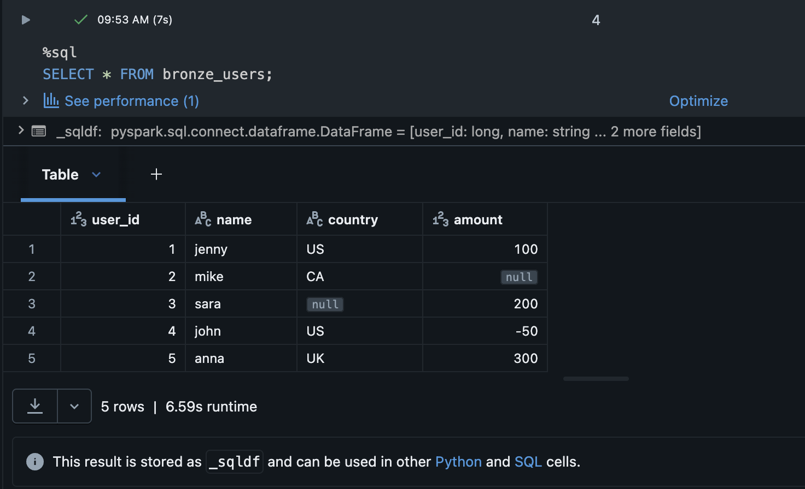
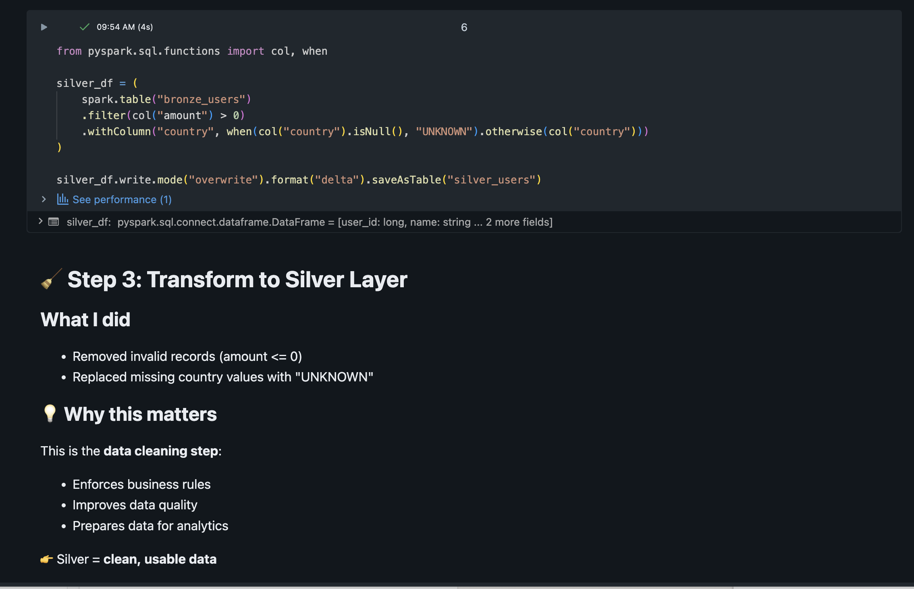
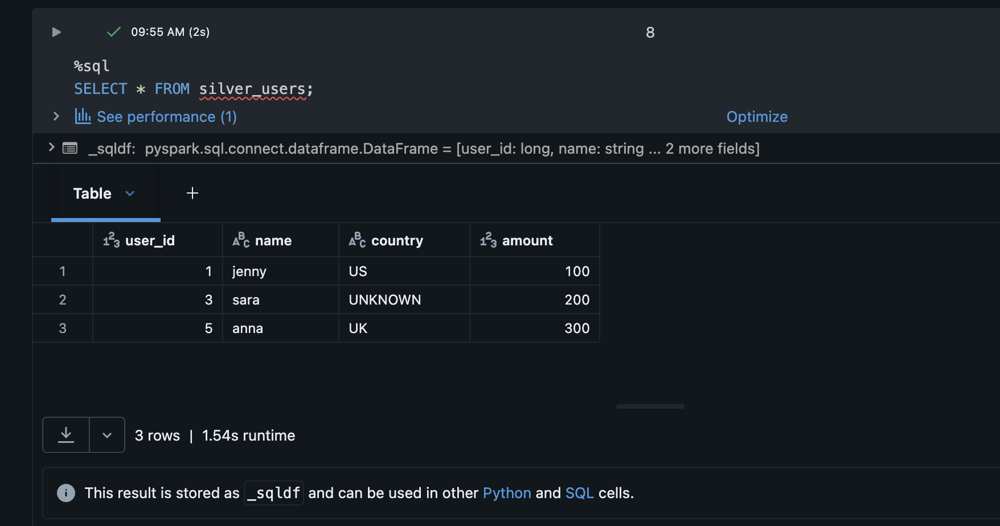

# Databricks Bronze to Silver Pipeline

## Overview

This project demonstrates a simple Bronze-to-Silver data pipeline using Databricks and Delta Lake.

The pipeline starts with raw ingestion-style data containing nulls, missing values, and invalid business values. It then applies data quality rules to create a cleaned Silver table that is more reliable and suitable for downstream analytics.

---

## Architecture

Bronze table → Silver table  
Raw data → Cleaned data  

---

## Project Flow

### Bronze Layer

The Bronze table stores raw data as it was received.

Example issues in the raw dataset:

- Missing country values  
- Null amount values  
- Negative amount values  

---

### Silver Layer

The Silver table applies cleaning rules:

- Removes invalid records where amount is not positive  
- Replaces missing country values with `UNKNOWN`  
- Stores the cleaned result as a Delta table  

---

## Technologies Used

- Databricks  
- Delta Lake  
- PySpark  
- SQL  

---

## Screenshots

### Bronze Raw Data

---

### Silver Transformation Logic

---

### Silver Cleaned Data

---

## Key Concepts Demonstrated

- Medallion Architecture  
- Bronze and Silver data layers  
- Delta table creation  
- Data quality filtering  
- Basic PySpark transformations  
- Clean notebook documentation  

---

## Key Takeaway

This project shows how raw ingestion data can be transformed into a cleaner, more reliable dataset using a Bronze-to-Silver pipeline pattern in Databricks.

This pattern is foundational in modern data engineering because it separates raw data capture from curated, analytics-ready data.
